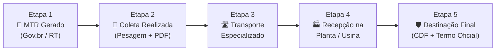

# 🌿 SafeWaste — Plataforma de Compliance & Rastreabilidade de Resíduos Clínicos (RSS)

<div align="center">


<br/>

**Solução Full-Stack para Rastreabilidade Ponta a Ponta, Gestão de Conformidade Regulatória (ANVISA / SINIR / MTR Nacional), Assinatura Digital e Validação Gov.br (Confiabilidades V3).**

[Visão Geral](#-visão-geral) •
[Funcionalidades](#-funcionalidades-principais) •
[Arquitetura](#-arquitetura--tecnologias) •
[Normas & Compliance](#-conformidade-regulatória--legislação) •
[Instalação & Uso](#-instalação-e-execução) •
[API REST](#-endpoints-da-api-rest) •
[Docker](#-executando-com-docker)

</div>

---

## 📌 Visão Geral

O descarte inadequado de **Resíduos de Serviços de Saúde (RSS)** — como materiais biológicos, pérfurocortantes, químicos e farmacêuticos — representa graves riscos à saúde pública e ao meio ambiente, além de sujeitar estabelecimentos de saúde a pesadas sanções, interdições e multas por parte da **ANVISA**, **INEMA** e **Órgãos Ambientais**.

O **SafeWaste** foi desenvolvido pelo time **DELTA MIND** durante o **Hackathon UNIMAM 2026** para transformar e digitalizar todo o ecossistema de gestão de resíduos clínicos. A plataforma integra em tempo real **Clínicas Geradoras**, **Empresas Coletoras/Transportadoras** e **Usinas de Destinação Final Licenciadas**, assegurando:

- 🛡️ **Rastreabilidade em 5 Etapas**: Do manifesto inicial (MTR) até o tratamento e emissão do Certificado de Destinação Final (CDF).
- 🔑 **Autenticação Gov.br & Assinatura Digital**: Integração com selos de confiabilidade Prata/Ouro (e-CPF ICP-Brasil e Biometria TSE) com validação de Responsável Técnico (CRBM, CRM, CRO, CRQ, COREN).
- 📁 **Gestão de Conformidade Documental**: Monitoramento de validade e alertas de PGRSS, Alvará Sanitário, Licença Ambiental de Operação (LAO) e Contrato de Coleta.
- 🔒 **Imutabilidade Criptográfica**: Log de auditoria gerando hashes SHA-256 para comprovação jurídica e sanitária incontestável.
- 📄 **Geração Automática de Documentos Oficiais em PDF**: Emissão dinâmica com layout regulatório de MTRs, Comprovantes de Coleta e Termos de Destinação Final.

---

## 🚀 Funcionalidades Principais

### 1. Duplo Perfil de Acesso (Geradora vs. Coletora)
- **Clínica Geradora**:
  - Geração de MTR Nacional com especificação de Grupo de Resíduo (A, B, C, D, E), peso estimado e acondicionamento.
  - Painel analítico de conformidade com gráficos mensais e peso total descartado.
  - Upload e acompanhamento de vencimento de documentos obrigatórios (PGRSS, Alvará, LAO, Contratos).
  - Consulta de histórico, download de termos de destinação e comprovantes com assinatura digital.
- **Empresa Coletora / Usina de Tratamento**:
  - Registro de coleta física (pesagem real aferida em balança, nome do motorista, placa do veículo).
  - Upload direto de Comprovantes de Coleta digitalizados em PDF.
  - Avanço de etapas de transporte e recepção na usina de tratamento.
  - Emissão e vinculação do **Termo de Destinação Final Licenciado** e código **CDF**.

### 2. Ciclo de Rastreabilidade em 5 Etapas (MTR Nacional)



### 3. Integração com Gov.br (API Confiabilidades V3)
- Simulação fiel da API oficial ConectaGov/Serpro:
  - `GET /auth/govbr/confiabilidades/{cpf}`: Retorna selos (ex.: `301` e-CPF ICP-Brasil, `201` Validação Previdenciária/Bancária).
  - `GET /auth/govbr/categorias/{cpf}` & `GET /auth/govbr/niveis/{cpf}` (Bronze, Prata e Ouro).
  - Validação estrita do CPF do Responsável Técnico (RT) vinculado à empresa antes da emissão de manifestos e termos.

### 4. Gestão Documental & Alertas de Vencimento
- Controle rigoroso dos 4 documentos pilares de compliance:
  1. **PGRSS** (Plano de Gerenciamento de Resíduos de Serviços de Saúde)
  2. **Alvará Sanitário Vigente**
  3. **Licença Ambiental de Operação (LAO - INEMA/Órgão Estadual)**
  4. **Contrato de Prestação de Serviços de Coleta Especializada**
- Indicadores visuais de status: `Válido`, `Vencendo (< 30 dias)` e `Vencido / Pendente`.

### 5. Auditoria Imutável (SHA-256)
- Registro transparente de todas as ações sensíveis (login Gov.br, emissão de MTR, registro de coleta, upload documental e emissão de termo de destinação).
- Cada log armazena data/hora, autor, papel, ação e **hash criptográfico SHA-256** único.

---

## 🏛️ Classificação de Resíduos Atendida (RDC 222/2018)

| Grupo | Classificação | Descrição & Exemplos | Tratamento / Destinação |
| :---: | :--- | :--- | :--- |
| **A** | **Infectantes / Biológicos** | Culturas, vacinas, sangue, hemoderivados, tecidos, luvas contaminadas. | Autoclavagem / Incineração / Descontaminação Térmica |
| **B** | **Químicos** | Medicamentos vencidos, reagentes, saneantes, efluentes de reveladores. | Neutralização / Coprocessamento / Incineração Especial |
| **C** | **Rejeitos Radioativos** | Materiais com radionuclídeos acima dos níveis de dispensa da CNEN. | Decaimento em abrigo seguro / Depósito CNEN |
| **D** | **Comuns / Recicláveis** | Papel de escritório, embalagens não contaminadas, resíduos de refeitório. | Reciclagem / Aterro Sanitário Licenciado |
| **E** | **Pérfurocortantes** | Agulhas, ampolas, lâminas de bisturi, lancetas, tubos capilares. | Descontaminação Térmica + Trituração / Incineração |

---

## 🏗️ Arquitetura & Tecnologias

```
safewaste/
├── backend/
│   ├── config/             # Conexão com SQLite / MySQL via Sequelize
│   ├── controllers/        # Controladores (Gov.br, Resíduos, Documentos, Empresas, Auditoria)
│   ├── models/             # Modelos Sequelize (ResiduoLog, Documento, AuditLog, Empresa, etc.)
│   ├── routes/             # Rotas da API REST (/api/v1/...)
│   ├── scripts/            # Script de sincronização e geração de PDFs (sync_all_pdfs.js)
│   ├── uploads/            # Armazenamento organizado de PDFs (documents, comprovantes, destinacao)
│   ├── utils/              # Utilitário PDFKit com templates regulatórios de alta fidelidade
│   ├── server.js           # Servidor Express, middlewares, seeds e bootstrap
│   └── package.json        # Dependências do backend
├── frontend/
│   ├── assets/             # Imagens, logos e ícones
│   ├── css/                # Folhas de estilo customizadas (styles.css)
│   ├── js/                 # Módulos JS (app.js, api.js, storage.js, ui.js, validators.js)
│   └── index.html          # Interface de usuário Single-Page responsiva (Desktop / Mobile)
├── Dockerfile              # Imagem Docker otimizada multi-stage Node 20
├── docker-compose.yml      # Orquestração do container SafeWaste com persistência de volumes
└── package.json            # Scripts globais do projeto
```

### Stack Tecnológico

- **Backend**: Node.js (v18+ / v20), Express 4, Sequelize ORM 6, SQLite3 / MySQL2, PDFKit, Multer, JWT, Bcryptjs.
- **Frontend**: HTML5, Vanilla JavaScript Modular (ES6+), Tailwind CSS, Lucide Icons, Chart.js.
- **Segurança & Criptografia**: SHA-256 Hashes, JSON Web Tokens (JWT), Validação Gov.br Confiabilidades V3.
- **DevOps**: Docker, Docker Compose, Multi-environment (`.env`).

---

## 💻 Instalação e Execução

### Pré-requisitos
- [Node.js](https://nodejs.org/) (versão 18.0.0 ou superior)
- [Git](https://git-scm.com/)
- [Docker](https://www.docker.com/) *(Opcional, para execução em containers)*

---

### Passo a Passo Local

1. **Clone o repositório:**
   ```bash
   git clone https://github.com/Kalive1125/safewaste.git
   cd safewaste
   ```

2. **Instale as dependências:**
   ```bash
   npm install
   # ou entre no backend diretamente:
   cd backend && npm install && cd ..
   ```

3. **Configure as variáveis de ambiente:**
   Copie o arquivo `.env.example` para `.env` dentro da pasta `backend/`:
   ```bash
   cp backend/.env.example backend/.env
   ```
   *(Por padrão, o SafeWaste já vem pré-configurado para operar com SQLite local automático e sem necessidade de configurações adicionais).*

4. **Inicie a aplicação:**
   ```bash
   npm start
   # ou para modo de desenvolvimento com hot-reload:
   npm run dev
   ```

5. **Acesse no navegador:**
   - 🌐 **Aplicação Web & Dashboard**: [http://localhost:3001](http://localhost:3001)
   - 🔌 **API Health & Metadados**: [http://localhost:3001/api/v1/config/metadados](http://localhost:3001/api/v1/config/metadados)

---

## 🐳 Executando com Docker

Você pode subir a aplicação completa em segundos utilizando o Docker Compose:

```bash
# Construir e iniciar os containers em segundo plano
docker-compose up -d --build

# Visualizar os logs em tempo real
docker-compose logs -f

# Parar os containers
docker-compose down
```

Os dados do banco SQLite e os arquivos PDF salvos serão persistidos automaticamente nos volumes mapeados.

---

## 📡 Endpoints da API REST

A API do SafeWaste responde sob o prefixo `/api/v1`.

### 🔐 Autenticação & Gov.br (Confiabilidades V3)
| Método | Rota | Descrição |
| :--- | :--- | :--- |
| `POST` | `/api/v1/auth/govbr/login` | Realiza login Gov.br com simulação de selos e níveis |
| `GET` | `/api/v1/auth/govbr/confiabilidades/:cpf` | Retorna selos de confiabilidade (ICP-Brasil, Bancos, etc.) |
| `GET` | `/api/v1/auth/govbr/categorias/:cpf` | Retorna categorias de confiabilidade do CPF |
| `GET` | `/api/v1/auth/govbr/niveis/:cpf` | Retorna o nível da conta Gov.br (Bronze, Prata ou Ouro) |
| `GET` | `/api/v1/auth/govbr/validar-vinculo-mtr` | Valida vínculo de Responsável Técnico com o MTR |

### ♻️ Resíduos & Rastreabilidade MTR
| Método | Rota | Descrição |
| :--- | :--- | :--- |
| `POST` | `/api/v1/residuos/gerar` | Emite novo manifesto MTR com assinatura digital |
| `GET` | `/api/v1/residuos` | Lista todos os resíduos e status de rastreabilidade |
| `GET` | `/api/v1/residuos/:mtrCodigo/rastreio` | Retorna o histórico detalhado e linha do tempo de um MTR |
| `POST` | `/api/v1/residuos/:mtrCodigo/coletar` | Registra a coleta física e anexa o comprovante PDF assinado |
| `PATCH` | `/api/v1/residuos/:mtrCodigo/avancar` | Avança o resíduo para transporte, usina ou destinação |
| `GET` | `/api/v1/residuos/:mtrCodigo/comprovante` | Download do PDF oficial do Comprovante de Coleta |
| `GET` | `/api/v1/residuos/:mtrCodigo/termo-validacao` | Download do PDF oficial do Termo de Destinação Final / CDF |

### 📄 Conformidade Documental
| Método | Rota | Descrição |
| :--- | :--- | :--- |
| `GET` | `/api/v1/documentos` | Lista os documentos de conformidade cadastrados |
| `GET` | `/api/v1/documentos/situacao` | Retorna o diagnóstico geral de conformidade sanitária |
| `POST` | `/api/v1/documentos/upload` | Realiza upload de novo documento em PDF |
| `GET` | `/api/v1/documentos/:id/download` | Download seguro do documento PDF |
| `DELETE` | `/api/v1/documentos/:id` | Exclui documento de conformidade |

### 📊 Relatórios & Auditoria
| Método | Rota | Descrição |
| :--- | :--- | :--- |
| `GET` | `/api/v1/relatorios/mensal` | Retorna consolidação estatística por mês/ano e grupos |
| `GET` | `/api/v1/auditoria/logs` | Lista o log de auditoria com hashes imutáveis SHA-256 |
| `GET` | `/api/v1/config/metadados` | Retorna metadados do sistema, normas e órgãos |

---

## 📜 Conformidade Regulatória & Legislação

O SafeWaste foi modelado em total conformidade com o arcabouço regulatório brasileiro:

1. **ANVISA — Resolução RDC nº 222/2018**: Regulamenta as Boas Práticas de Gerenciamento dos Resíduos de Serviços de Saúde em todas as etapas (segregação, acondicionamento, identificação, transporte interno, armazenamento, coleta e destinação).
2. **Ministério do Meio Ambiente (MMA) — Portaria nº 280/2020**: Institui o Manifesto de Transporte de Resíduos (MTR Nacional) e o Sistema Nacional de Informações sobre a Gestão dos Resíduos Sólidos (SINIR).
3. **CONAMA — Resoluções nº 358/2005 e 316/2002**: Diretrizes para tratamento e disposição final de resíduos de saúde.
4. **Lei Federal nº 12.305/2010**: Política Nacional de Resíduos Sólidos (PNRS) e responsabilidade compartilhada pelo ciclo de vida dos produtos.
5. **LGPD (Lei nº 13.709/2018)**: Proteção de dados cadastrais, anonimização em logs e conformidade com credenciais digitais.

---

## 👥 Equipe — DELTA MIND (Hackathon UNIMAM 2026)

Desenvolvido com excelência técnica, foco em impacto socioambiental e conformidade sanitária para a área da saúde.

---

## 📄 Licença

Este projeto está sob a licença [ISC](LICENSE).

<div align="center">
  <sub>SafeWaste &copy; 2026 — Plataforma de Compliance e Rastreabilidade de Resíduos de Serviços de Saúde.</sub>
</div>
